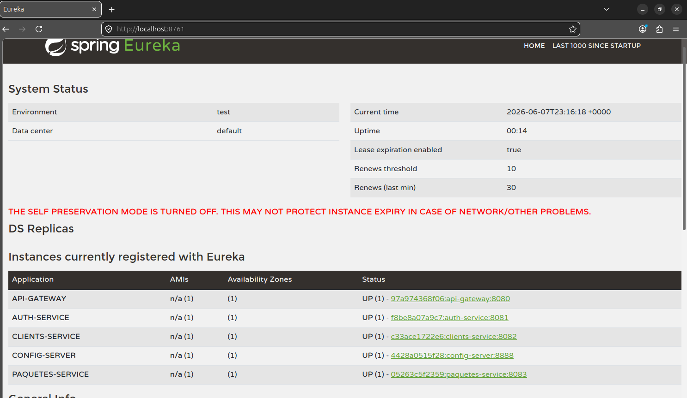
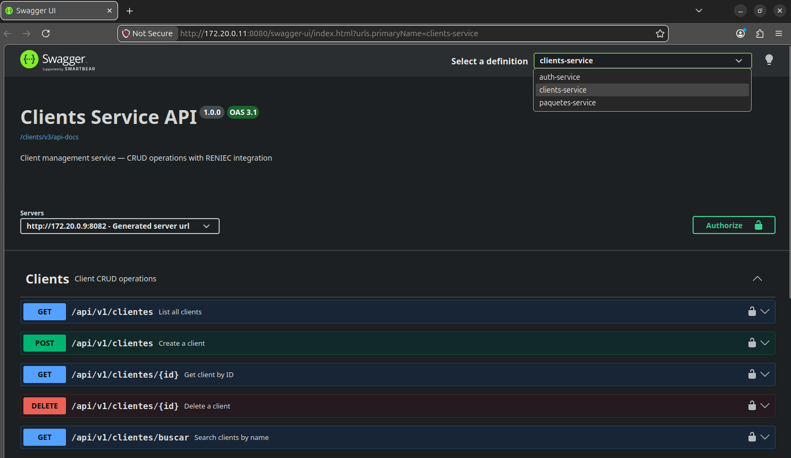

# RapidoCourier — Sistema de Microservicios

Plataforma de mensajería y paquetería basada en microservicios con Spring Boot, arquitectura hexagonal y despliegue Docker.

---

## Tabla de Contenidos

1. [Cómo Ejecutar](#1-cómo-ejecutar)
2. [Eureka Dashboard](#2-eureka-dashboard)
3. [Pruebas y Documentación](#3-pruebas-y-documentación)
4. [CI/CD con GitHub Actions](#4-cicd-con-github-actions)
5. [Mapa de Microservicios](#5-mapa-de-microservicios)
6. [Arquitectura General](#6-arquitectura-general)
7. [Dependencias entre Servicios](#7-dependencias-entre-servicios)
8. [Modelo de Datos por Servicio](#8-modelo-de-datos-por-servicio)
9. [Justificación de Bases de Datos](#9-justificación-de-bases-de-datos)
10. [Justificación de Arquitectura Interna](#10-justificación-de-arquitectura-interna)
11. [Regla de Cálculo de Tarifa (RF-03)](#11-regla-de-cálculo-de-tarifa-rf-03)
12. [Estados y Transiciones del Paquete (RF-04)](#12-estados-y-transiciones-del-paquete-rf-04)
13. [Comunicación Inter-Servicio](#13-comunicación-inter-servicio)
14. [Seguridad y JWT](#14-seguridad-y-jwt)
15. [Gestión de Secretos con Vault](#15-gestión-de-secretos-con-vault)
16. [Circuit Breaker y Resiliencia](#16-circuit-breaker-y-resiliencia)
17. [Hot Reload de Configuración](#17-hot-reload-de-configuración)
18. [Pruebas Unitarias](#18-pruebas-unitarias)

---

## 1. Cómo Ejecutar

### Requisitos

- Docker y Docker Compose v2+

### Paso 1: Clonar

```bash
git clone https://github.com/Shiar-owo/Rapido-Curier.git
cd RapidoCurier
```

### Paso 2: Levantar todo

```bash
docker compose up --build -d
```

Cada servicio de negocio y de infraestructura incluye su propio `Dockerfile` con **multi-stage build**: la primera etapa (`maven:3.9-eclipse-temurin-17-alpine`) compila el proyecto con Maven dentro del contenedor, y la segunda (`eclipse-temurin:17-jre-alpine`) genera una imagen JRE ligera para producción. El flag `--build` ejecuta estas etapas automáticamente para cada servicio.

El `docker-compose.yml` define `depends_on` con health checks, por lo que el orden de arranque se gestiona automáticamente: Vault y PostgreSQL arrancan primero, luego Config Server y Eureka, y finalmente los servicios de negocio y el Gateway.

> **Opcional:** El Config Server clona automáticamente el repositorio de configuración desde GitHub (`https://github.com/Shiar-owo/Rapido-Curier-Configs`) al arrancar. No es necesario clonarlo manualmente.

### Paso 3: Verificar

```bash
curl http://localhost:8761/eureka/apps
```

### Puertos Expuestos

| Puerto | Servicio | Acceso |
|--------|----------|--------|
| `8080` | API Gateway | Externo (único punto de entrada) |
| `8761` | Eureka Server | Externo (dashboard) |
| `8888` | Config Server | Externo |
| `8200` | Vault | Externo (UI dev mode) |
| `8081` | auth-service | Solo red Docker |
| `8082` | clients-service | Solo red Docker |
| `8083` | paquetes-service | Solo red Docker |

> Los servicios de negocio **no están expuestos al host** (RNF-08). Todo el tráfico pasa por el Gateway.

---

## 2. Eureka Dashboard

El dashboard de Eureka está disponible en **http://localhost:8761**. Muestra todos los servicios registrados en estado `UP`:

| Aplicación | Instancias | Estado |
|-----------|-----------|--------|
| API-GATEWAY | 1 | UP |
| AUTH-SERVICE | 1 | UP |
| CONFIG-SERVER | 1 | UP |
| CLIENTS-SERVICE | 1 | UP |
| PAQUETES-SERVICE | 1 | UP |

**Heartbeat configurado en config-server:**
```yaml
eureka.instance.lease-renewal-interval-in-seconds: 10   # Heartbeat cada 10s
eureka.instance.lease-expiration-duration-in-seconds: 30  # Expira tras 30s sin heartbeat
```



---

## 3. Pruebas y Documentación

### Casos de Prueba

El archivo [`examples.md`](examples.md) contiene **53 casos de prueba** que cubren todos los endpoints del sistema: autenticación, clientes (CRUD, RENIEC, roles), paquetes (registro, estados, búsquedas, CLIENTE endpoints), categorías (CRUD, asignación, roles) y seguridad (401, 403).

### Script de Pruebas

```bash
bash run-tests.sh    # Ejecuta los 53 casos contra el Gateway (localhost:8080)
```

El script registra usuarios (ADMIN, OPERADOR, CLIENTE), crea clientes con RENIEC, paquetes, categorías, y valida cada respuesta HTTP esperada. Requiere que todos los contenedores estén arriba.

### Swagger UI



La documentación OpenAPI está disponible en:
- **Swagger UI:** http://localhost:8080/swagger-ui.html

### Pruebas Unitarias

```bash
cd auth-service && mvn test        # 15 tests
cd clients-service && mvn test     # 46 tests
cd paquetes-service && mvn test    # 135 tests
```

---

## 4. CI/CD con GitHub Actions

Se utiliza **GitHub Actions** como alternativa a Jenkins por las siguientes razones:

| Criterio | GitHub Actions | Jenkins |
|----------|---------------|---------|
| Configuración | YAML en el repositorio | Interfaz web + scripts Groovy |
| Mantenimiento | Sin servidor que administrar | Requiere servidor dedicado |
| Integración con GitHub | Nativa (triggers, secrets, permissions) | Requiere plugins adicionales |
| Costo | 2000 min/mes gratis | Infraestructura propia |

### Workflows por servicio

| Workflow | Disparador | Acciones |
|----------|-----------|----------|
| `auth-service-ci-cd.yml` | push/PR a main + path `auth-service/**` | Test → Build → Docker image |
| `clients-service-ci-cd.yml` | push/PR a main + path `clients-service/**` | Test → Build → Docker image |
| `paquetes-service-ci-cd.yml` | push/PR a main + path `paquetes-service/**` | Test → Build → Docker image |
| `api-gateway-ci-cd.yml` | push/PR a main + path `api-gateway/**` | Test → Build → Docker image |

Cada workflow se ejecuta **solo** cuando cambian archivos de su servicio (path filter), evitando builds innecesarios.

---

## 5. Mapa de Microservicios

| Servicio | Bounded Context | Entidades | RF Implementados | BD | Comunicación |
|----------|----------------|-----------|-----------------|-----|-------------|
| **auth-service** | Autenticación y autorización | `Usuario`, `Rol` | RF-08 (roles) | PostgreSQL `rapidocourier_auth` | Ninguna |
| **clients-service** | Gestión de clientes | `Cliente` | RF-01 (registro con RENIEC), RF-08 (roles) | PostgreSQL `rapidocourier_clientes` | Llama a RENIEC API (Feign + Circuit Breaker) |
| **paquetes-service** | Envíos y tracking | `Paquete`, `Categoria`, `HistorialEstado` | RF-02, RF-03, RF-04, RF-05, RF-06, RF-07, RF-09 | PostgreSQL `rapidocourier_paquetes` | Llama a clients-service vía Feign (verificar clientes, obtener nombres) |

### Servicios de Infraestructura

| Servicio | Puerto | Función |
|----------|--------|---------|
| **api-gateway** | `8080` | Punto de entrada único, JWT validation, enrutamiento |
| **eureka-server** | `8761` | Service Discovery |
| **config-server** | `8888` | Configuración centralizada (Git backend) |
| **vault** | `8200` | Gestión de secretos (JWT, RENIEC, DB credentials) |

---

## 6. Arquitectura General

```
                        ┌──────────────────┐
                        │     Vault        │
                        │    :8200         │
                        │  (secrets/kv)    │
                        └────────┬─────────┘
                                 │ lectura de secretos
┌──────────────┐    ┌────────────▼──────────┐
│   Git Repo   │───▶│    Config Server      │
│ (configs)    │    │       :8888           │
└──────────────┘    └────────────┬──────────┘
                                 │
┌────────────────────────────────▼─────────────────────────────────┐
│                        Eureka Server :8761                       │
│              (Service Discovery — todos se registran)            │
└──────┬────────────┬───────────────┬──────────────────┬───────────┘
       │            │               │                  │
       ▼            ▼               ▼                  ▼
┌────────────┐ ┌────────────┐ ┌────────────┐   ┌────────────┐
│    API     │ │    auth    │ │  clients   │   │  paquetes  │
│  Gateway   │ │  service   │ │  service   │   │  service   │
│   :8080    │ │   :8081    │ │   :8082    │   │   :8083    │
└─────┬──────┘ └────────────┘ └─────┬──────┘   └─────┬──────┘
      │                             │                 │
      │ JWT validado aquí           │                 │ Feign ──▶ clients-service
      │ Headers propagados:         │ Feign ──▶       │          (verificar clientes,
      │ X-User-Id, X-User-Roles,   │ RENIEC API      │           obtener nombres,
      │ X-User-Email                │ (+ CB + Retry)  │           buscar por email)
      │                             │                 │
      └──── Solo los clientes ──────┘─────────────────┘
           interactúan vía el Gateway
```

---

## 7. Dependencias entre Servicios

| Servicio Origen | Servicio Destino | Tipo | Protocolo | Descripción |
|----------------|-----------------|------|-----------|-------------|
| **api-gateway** | **auth-service** | Sincrónica | HTTP/REST | Proxy de rutas |
| **api-gateway** | **clients-service** | Sincrónica | HTTP/REST | Proxy de rutas |
| **api-gateway** | **paquetes-service** | Sincrónica | HTTP/REST | Proxy de rutas |
| **clients-service** | **RENIEC API** | Sincrónica | HTTP/REST (Feign) | Consulta DNI para registro de clientes |
| **paquetes-service** | **clients-service** | Sincrónica | HTTP/REST (Feign) | Verificar existencia de remitente/destinatario al registrar paquete; obtener nombres completos para enriquecer respuestas; buscar cliente por email para endpoints CLIENTE (`/mis-paquetes`) |
| **auth-service** | **Vault** | Sincrónica | HTTP | Lee `jwt.secret` al arrancar |
| **clients-service** | **Vault** | Sincrónica | HTTP | Lee `reniec.api.token`, DB credentials |
| **paquetes-service** | **Vault** | Sincrónica | HTTP | Lee `jwt.secret`, DB credentials |
| **Todos los servicios** | **Config Server** | Sincrónica | HTTP | Obtienen configuración centralizada |
| **Todos los servicios** | **Eureka Server** | Sincrónica | HTTP | Registro y descubrimiento |

---

## 8. Modelo de Datos por Servicio

### auth-service (`rapidocourier_auth`)

```
┌─────────────────┐      ┌──────────────────┐      ┌─────────────────┐
│     roles        │      │  usuario_roles    │      │    usuarios      │
├─────────────────┤      ├──────────────────┤      ├─────────────────┤
│ id UUID (PK)    │◀─────│ usuario_id UUID  │─────▶│ id UUID (PK)    │
│ nombre VARCHAR  │      │ rol_id UUID      │      │ nombre VARCHAR  │
│    (20) UNIQUE  │      │    (composite PK)│      │ password VARCHAR│
└─────────────────┘      └──────────────────┘      │ email VARCHAR   │
                                                   │   (100) UNIQUE  │
                                                   └─────────────────┘
```

### clients-service (`rapidocourier_clientes`)

```
┌─────────────────────────────────┐
│           clientes               │
├─────────────────────────────────┤
│ id UUID (PK)                    │
│ dni VARCHAR(8) UNIQUE           │
│ nombre VARCHAR(100)             │
│ apellido_paterno VARCHAR(100)   │
│ apellido_materno VARCHAR(100)   │
│ email VARCHAR(255) UNIQUE       │
│ created_at TIMESTAMPTZ          │
│ updated_at TIMESTAMPTZ          │
└─────────────────────────────────┘
  Índices: dni, email
```

### paquetes-service (`rapidocourier_paquetes`)

```
┌──────────────────┐    ┌──────────────────────┐    ┌──────────────────┐
│    categorias     │    │   paquete_categoria   │    │     paquetes      │
├──────────────────┤    ├──────────────────────┤    ├──────────────────┤
│ id UUID (PK)     │◀───│ paquete_id UUID (FK) │───▶│ id UUID (PK)     │
│ nombre VARCHAR   │    │ categoria_id UUID(FK)│    │ codigo_rastreo   │
│   (100) UNIQUE   │    │    (composite PK)    │    │   VARCHAR(20)    │
│ descripcion      │    └──────────────────────┘    │   UNIQUE         │
│   VARCHAR(255)   │                                │ remitente_id UUID│
└──────────────────┘                                │ destinatario_id  │
                                                    │ peso_kg DOUBLE   │
                                                    │ valor_declarado  │
                                                    │ sucursal_origen  │
                                                    │ sucursal_destino │
                                                    │ tarifa DOUBLE    │
                                                    │ estado_actual    │
                                                    │ created_at       │
                                                    │ updated_at       │
                                                    └────────┬─────────┘
                                                             │
                                              ┌──────────────▼──────────────┐
                                              │      historial_estado        │
                                              ├─────────────────────────────┤
                                              │ id UUID (PK)                │
                                              │ paquete_id UUID (FK)        │
                                              │ estado VARCHAR(30)          │
                                              │ fecha_cambio TIMESTAMPTZ    │
                                              │ usuario_responsable VARCHAR │
                                              └─────────────────────────────┘
```

**Índices:** `codigo_rastreo`, `remitente_id`, `destinatario_id`, `estado_actual`, `historial_estado(paquete_id)`

**Relaciones:**
- `paquete_categoria`: `@ManyToMany` con tabla intermedia explícita (RF-09)
- `historial_estado → paquetes`: `@ManyToOne` / `@OneToMany`

---

## 9. Justificación de Bases de Datos

| Servicio | BD | Justificación |
|----------|-----|---------------|
| **auth-service** | PostgreSQL 16 | Relacional simple (usuarios, roles, N:M). Transacciones ACID para operaciones de autenticación. UUIDs como PKs. |
| **clients-service** | PostgreSQL 16 | Datos estructurados con restricciones UNIQUE (DNI, email). Necesita índices B-tree para búsquedas por nombre. JPA Auditing con `OffsetDateTime`. |
| **paquetes-service** | PostgreSQL 16 | Modelo relacional con `@ManyToMany` (categorías), `@OneToMany` (historial). Consultas JPQL complejas con JOIN FETCH. Transacciones para registro de paquete + historial atómico. |

**Decisión:** Se usa PostgreSQL de forma políglota (una BD por servicio) para garantizar independencia de datos y escalabilidad independiente. Cada BD tiene su propio contenedor Docker sin exposición al host, accesible solo dentro de la red `rapidocourier-net`.

---

## 10. Justificación de Arquitectura Interna

Todos los servicios de negocio siguen **Arquitectura Hexagonal (Ports & Adapters)**:

```
HTTP Request → Controller (adapter in) → UseCase (port in) → Service → RepositoryPort (port out) → RepositoryAdapter (adapter out) → JPA
```

### Por qué Hexagonal:

1. **Separación de concerns:** El dominio no depende de frameworks ni infraestructura.
2. **Testeabilidad:** Los puertos de entrada se prueban con mocks de puertos de salida; sin arrancar Spring.
3. **Cambios de infraestructura:** Cambiar de JPA a MongoDB solo implica crear un nuevo adapter de salida, sin tocar la lógica de negocio.
4. **Consistencia:** Todos los servicios usan la misma estructura, facilitando el mantenimiento.

### Paquetes comunes:

- `domain/model/` — Entidades de dominio con constructores privados y factory methods
- `domain/port/in/` — Puertos de entrada (use cases)
- `domain/port/out/` — Puertos de salida (repositorios, Feign clients)
- `application/service/` — Implementación de use cases
- `infrastructure/adapter/in/rest/` — Controladores, DTOs, mappers
- `infrastructure/adapter/out/` — Implementaciones de puertos de salida (JPA, Feign)
- `infrastructure/config/` — Configuración de seguridad, auditoría, excepciones

---

## 11. Regla de Cálculo de Tarifa (RF-03)

La tarifa se calcula automáticamente al registrar un paquete:

```
tarifa_total = (pesoKg × costoPorKg) + (valorDeclarado × porcentajeValor) + tarifaRuta
```

### Parámetros (configurables vía Config Server, hot-reloadable con `@RefreshScope`):

| Parámetro | Valor por defecto | Descripción |
|-----------|-------------------|-------------|
| `tarifa.costoPorKg` | `8.0` S/./kg | Costo por kilogramo |
| `tarifa.porcentajeValorDeclarado` | `0.01` (1%) | Porcentaje del valor declarado |
| `tarifa.tarifaDefault` | `5.0` S/. | Tarifa base para rutas no definidas |

### Recargos por ruta:

| Ruta | Recargo (S/.) |
|------|---------------|
| LIMA → AREQUIPA | 15.0 |
| AREQUIPA → LIMA | 15.0 |
| LIMA → CUSCO | 20.0 |
| CUSCO → LIMA | 20.0 |
| AREQUIPA → CUSCO | 12.0 |
| CUSCO → AREQUIPA | 12.0 |

### Ejemplo:

Paquete de **5 kg**, valor declarado **S/. 1000**, de LIMA a CUSCO:

```
tarifa = (5 × 8.0) + (1000 × 0.01) + 20.0
       = 40.0 + 10.0 + 20.0
       = S/. 70.00
```

---

## 12. Estados y Transiciones del Paquete (RF-04)

### Estados

| Estado | Descripción |
|--------|-------------|
| `REGISTRADO` | Paquete recién creado por un operador |
| `EN_ALMACEN` | Almacenado en la sucursal de origen |
| `EN_TRANSITO` | En tránsito entre sucursales |
| `EN_REPARTO` | En reparto al destinatario final |
| `ENTREGADO` | Entregado exitosamente **(estado terminal)** |
| `NO_ENTREGADO` | Intento de entrega fallido |

### Diagrama de Transiciones

```
REGISTRADO ──▶ EN_ALMACEN ──▶ EN_TRANSITO ──▶ EN_REPARTO ──▶ ENTREGADO
                                   │               │
                                   │               ▼
                                   │         NO_ENTREGADO
                                   │               │
                                   └───────────────┘
                                   (retorna a EN_ALMACEN)
```

### Transiciones Válidas

| Estado Actual | Siguiente Estado Permitido |
|---------------|---------------------------|
| `REGISTRADO` | `EN_ALMACEN` |
| `EN_ALMACEN` | `EN_TRANSITO` |
| `EN_TRANSITO` | `EN_REPARTO` |
| `EN_REPARTO` | `ENTREGADO`, `NO_ENTREGADO` |
| `NO_ENTREGADO` | `EN_ALMACEN` |
| `ENTREGADO` | *(ninguno — terminal)* |

Una transición inválida retorna **409 Conflict** con mensaje descriptivo indicando la transición intentada y las permitidas.

---

## 13. Comunicación Inter-Servicio

### Tipo: Sincrónica (Feign Client)

Se eligió comunicación **sincrónica** para ambos flujos inter-servicio:

1. **paquetes-service → clients-service** (Feign + Load Balancing vía Eureka)
   - **Por qué sync:** El registro de paquete requiere verificar que remitente y destinatario existen **antes** de persistir. La integridad referencial entre servicios es crítica para el negocio.
   - **Datos consultados:** UUID del cliente, nombre completo, DNI, email.
   - **Endpoints Feign:** `GET /{id}`, `GET /buscar?nombre=`, `GET /por-email?email=`
   - **Resiliencia:** `@CircuitBreaker` + `@Retry` con backoff exponencial. Si clients-service no está disponible, el fallback lanza `ExternalServiceException` (502).

2. **clients-service → RENIEC API** (Feign directo)
   - **Por qué sync:** El nombre del cliente debe obtenerse de RENIEC en el momento del registro. No hay escenario donde se necesite diferir esta consulta.
   - **Resiliencia:** `@CircuitBreaker` + `@Retry`. Si RENIEC falla, se retorna 502.

### Headers de Trazabilidad

El Gateway propaga **tres headers** como headers HTTP reales:
- `X-User-Id` — UUID del usuario (JWT `sub`)
- `X-User-Roles` — Roles del usuario (JWT `roles`)
- `X-User-Email` — Email del usuario (JWT `email`)

Paquetes-service los reenvía en llamadas Feign a clients-service vía `FeignAuthInterceptor`. El header `X-User-Email` se usa para resolver la identidad de CLIENTE en los endpoints de paquetes propios.

---

## 14. Seguridad y JWT

### Estrategia: JWT Validado Solo en el Gateway

El JWT se valida **exclusivamente** en el API Gateway (`JwtAuthenticationFilter`). Los servicios de negocio reciben headers `X-User-Id`, `X-User-Roles` y `X-User-Email` pre-validados.

**Por qué centralizar en el Gateway:**
- Evita duplicar la lógica de validación JWT en cada servicio.
- Los servicios solo necesitan un filtro de headers simples (`HeaderAuthenticationFilter`).
- El secreto JWT está en Vault, accesible solo por el Gateway.

### Flujo de Autenticación

```
1. POST /api/v1/auth/login → JWT (HS256)
2. Cliente envía: Authorization: Bearer <token>
3. Gateway (JwtAuthenticationFilter):
   a. Decodifica y valida JWT (firma, expiración)
   b. Extrae userId, roles, email
   c. Setea SecurityContext con GrantedAuthority (ROLE_xxx)
   d. Agrega headers X-User-Id, X-User-Roles, X-User-Email al request
4. Servicio destino (HeaderAuthenticationFilter):
   a. Lee X-User-Id, X-User-Roles, X-User-Email
   b. Crea UsernamePasswordAuthenticationToken
   c. @PreAuthorize verifica permisos
```

### Roles (RF-08)

| Rol | Permisos |
|-----|----------|
| `ADMIN` | Acceso total: CRUD de clientes, paquetes, categorías. Eliminar registros. |
| `OPERADOR` | Crear/consultar/actualizar paquetes y clientes. No puede eliminar. |
| `CLIENTE` | Solo consultar sus propios paquetes (`/mis-paquetes`) y historial. Identidad resuelta por email (Feign `buscarPorEmail`). |

### DataInitializer

Al arrancar auth-service, se crean automáticamente:
- 3 roles: `ADMIN`, `OPERADOR`, `CLIENTE`
- 3 usuarios iniciales (ver en `DataInitializer.java`)

---

## 15. Gestión de Secretos con Vault

Vault corre en **modo desarrollo** con token `dev-only-token`. Los secretos se almacenan en KV v2:

| Path en Vault | Contenido |
|---------------|-----------|
| `secret/auth-service` | `jwt.secret`, `jwt.expiration`, `db.username`, `db.password` |
| `secret/clients-service` | `reniec.api.token`, `db.username`, `db.password` |
| `secret/api-gateway` | `jwt.secret` |
| `secret/paquetes-service` | `jwt.secret`, `db.username`, `db.password` |

### Flujo de lectura

```
Vault ← vault-init (contenedor) ← init-vault.sh
  │
  └──▶ Cada servicio lee sus secretos vía spring.config.import: vault://
       Config Server también lee desde Vault para servir configuración.
```

### Configuración de Vault en los clientes

Se utiliza `spring.config.import: vault://` en `application.yaml` en lugar del enfoque tradicional con `bootstrap.yaml`. Esta es la forma recomendada desde Spring Boot 2.4+ / Spring Cloud 2020+, ya que simplifica la configuración eliminando el contexto de arranque separado (*bootstrap context*) que requería un archivo y dependencia adicionales (`spring-cloud-starter-bootstrap`). El resultado es idéntico: cada servicio conecta a Vault al iniciar y lee sus secretos del KV store.

**El secreto JWT NO aparece en ningún archivo del repositorio.** Solo existe en Vault y se inyecta dinámicamente al arrancar cada servicio.

---

## 16. Circuit Breaker y Resiliencia

### Configuración en paquetes-service

**Circuit Breaker (`clients-service`):**
| Parámetro | Valor |
|-----------|-------|
| `failureRateThreshold` | 50% |
| `waitDurationInOpenState` | 10s |
| `slidingWindowSize` | 5 |
| `permittedNumberOfCallsInHalfOpenState` | 3 |
| `slowCallDurationThreshold` | 2s |
| `slowCallRateThreshold` | 50% |

**Retry (`clients-service`):**
| Parámetro | Valor |
|-----------|-------|
| `maxAttempts` | 3 |
| `waitDuration` | 500ms |
| `enableExponentialBackoff` | true |

### Endpoint de Monitoreo

```bash
# Acceder al estado de circuit breakers (desde dentro de la red Docker)
docker exec paquetes-service wget -qO- http://localhost:8083/actuator/circuitbreakers

# Respuesta:
{
  "circuitBreakers": {
    "clients-service": {
      "state": "CLOSED",
      "failureRate": "0.0%",
      "bufferedCalls": 5,
      "failedCalls": 0
    }
  }
}
```


---

## 17. Hot Reload de Configuración

La tarifa del paquete (`TarifaProperties`) es hot-reloadable con `@RefreshScope`:

```bash
# 1. Verificar tarifa actual
curl -s http://localhost:8080/api/v1/paquetes/buscar?texto=RC \
  -H "Authorization: Bearer $TOKEN" | jq '.data[0].tarifa'

# 2. Modificar en el repo de configs (Rapido-Curier-Configs/paquetes-service.yaml):
#    tarifa:
#      costoPorKg: 12.0

# 3. Ejecutar refresh
curl -X POST http://localhost:8083/actuator/refresh \
  -H "Content-Type: application/json"

# 4. Verificar cambio (sin reiniciar el servicio)
curl -s http://localhost:8080/api/v1/paquetes/buscar?texto=RC \
  -H "Authorization: Bearer $TOKEN" | jq '.data[0].tarifa'
```

---

## 18. Pruebas Unitarias

| Servicio | Archivo | Tipo | Tests | Cobertura |
|----------|---------|------|-------|-----------|
| **auth-service** | `AuthServiceTest` | Unit (Mockito) | 5 | Happy path, credenciales inválidas, email duplicado |
| **auth-service** | `AuthControllerTest` | WebMvcTest | 6 | Login, register, validación |
| **api-gateway** | `JwtAuthenticationFilterUnitTest` | Unit (Mockito) | 7 | X-User-Id, X-User-Roles, X-User-Email headers |
| **clients-service** | `ClienteServiceTest` | Unit (Mockito) | 5 | Happy path, DNI duplicado, email duplicado |
| **clients-service** | `ReniecAdapterTest` | Unit (Mockito) | 8 | RENIEC success, 404, 500, 502, 503 |
| **clients-service** | `ClienteControllerTest` | WebMvcTest | 13 | CRUD completo, roles, validación |
| **clients-service** | `GlobalExceptionHandlerTest` | WebMvcTest | 6 | 400, 404, 409, 502 |
| **clients-service** | `ClienteRepositoryAdapterTest` | Integration (Testcontainers) | 8 | CRUD con BD real |
| **clients-service** | `ClienteMapperTest` | Unit | 3 | Mapeo entity ↔ domain |
| **paquetes-service** | `PaqueteServiceTest` | Unit (Mockito) | 31 | Happy path, transición inválida, cliente no encontrado, mis-paquetes |
| **paquetes-service** | `PaqueteControllerTest` | WebMvcTest | 24 | CRUD, roles, CLIENTE endpoints con email resolution |
| **paquetes-service** | `CategoriaControllerTest` | WebMvcTest | 5 | CRUD categorías, ADMIN-only |
| **paquetes-service** | `GlobalExceptionHandlerTest` | WebMvcTest | 6 | 400, 404, 409, 502 |
| **paquetes-service** | `ClienteFeignAdapterTest` | Unit (Mockito) | 12 | obtenerCliente, buscarPorNombre, buscarPorEmail — success, 404, error, fallback |
| **paquetes-service** | Repository tests | Integration (Testcontainers) | 16 | CRUD con BD real |

### Ejecutar pruebas

```bash
# Pruebas unitarias
cd auth-service && mvn test        # 15 tests
cd clients-service && mvn test     # 46 tests
cd paquetes-service && mvn test    # 135 tests

# Pruebas de integración (requiere Docker corriendo)
bash run-tests.sh                  # 53 casos contra el API Gateway
```

> Los servicios de negocio **no están expuestos al host** (RNF-08). Todo el tráfico pasa por el Gateway.
